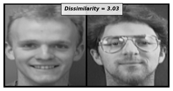
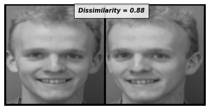
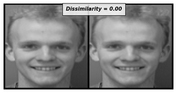
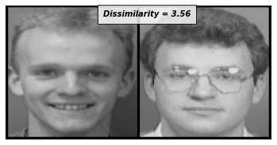
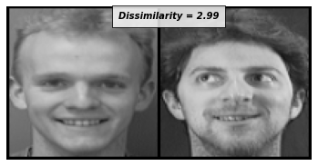
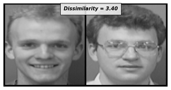
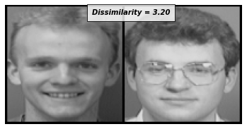
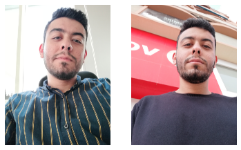
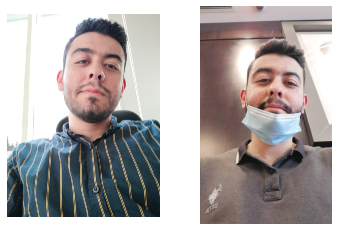

# Facial Similarity
This project helps to discover if the given two images are similar or not.

I have implemented this project in two ways:

## Creating Siamese Network From Scratch
I have created siamese network architecture then training and testing it. The structure as follows:
- Importing The Dependencies
- Loading The Data
- Preparing The Data
- Data Inspection
- Building The Siamese Network
- Training The Network
- Testing The Network

A sample of the testing data is necessary to determine how well the Siamese network performs.

              

<a href='https://www.kaggle.com/datasets/kasikrit/att-database-of-faces'>Data Link</a>

## Creating Siamese Network By Using VGGFace 
The structure as follows:
- Importing The Dependencies
- Building VGGFace Network
- Test The Network

The performance of the pre-trained model shows accurate similarity.

- Similarity Score = 0.33137047290802

- The images are similar

- Similarity Score = 0.42168527841567993

- The images aren't similar

- Similarity Score = 0.41622310876846313

- The images aren't similar

- Similarity Score = 0.32001131772994995

- The images are similar
